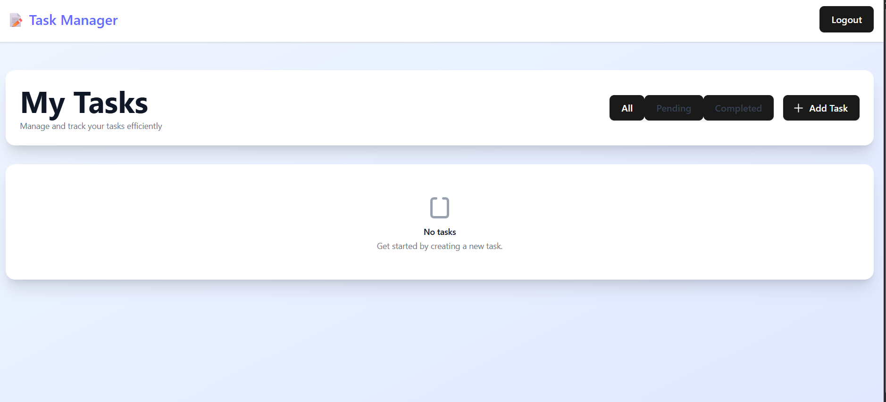
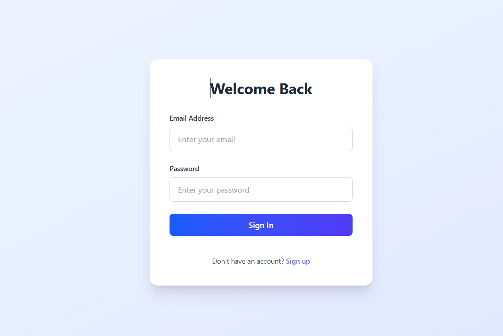
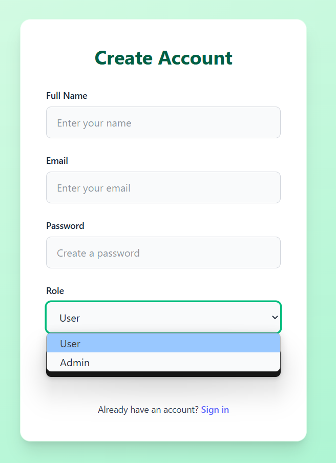
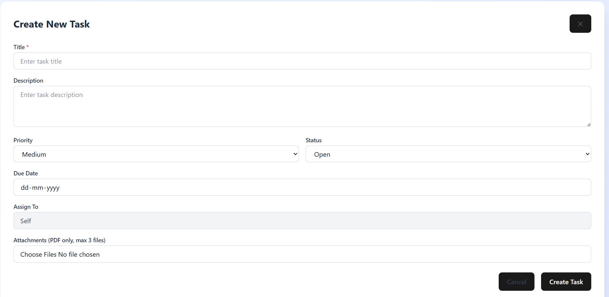

# 🚀 Task Management Web App (MERN Stack)

A full-featured task management web application with **user/admin authentication**, **role-based access**, **file uploads**, and **real-time dashboard filtering**. Built with the **MERN stack** (MongoDB, Express, React, Node.js) using **Redux Toolkit** and **Tailwind CSS**.

---

## 🛠️ Tech Stack

- **Frontend:** React + Vite, Redux Toolkit, Tailwind CSS
- **Backend:** Node.js, Express, MongoDB, Mongoose
- **Authentication:** JWT, Role-based middleware
- **File Uploads:** Multer (PDFs only)
- **State Management:** Redux Toolkit with Async Thunks
- **Deployment-ready:** `.env` support, clean folder structure

---

## 📂 Project Structure

```
Task-Manager-System/
├── backend/
│   ├── config/
│   │   └── db.js
│   ├── controllers/
│   │   ├── authController.js
│   │   ├── taskController.js
│   │   └── userController.js
│   ├── Dockerfile
│   ├── middleware/
│   │   ├── authMiddleware.js
│   │   └── roleMiddleware.js
│   ├── models/
│   │   ├── Task.js
│   │   └── User.js
│   ├── package-lock.json
│   ├── package.json
│   ├── README.md
│   ├── routes/
│   │   ├── authRoutes.js
│   │   ├── taskRoutes.js
│   │   └── userRoutes.js
│   ├── scripts/
│   │   ├── checkDatabase.js
│   │   ├── convertPendingToOngoing.js
│   │   ├── getUserId.js
│   │   └── seedTasks.js
│   ├── server.js
│   ├── tests/
│   │   ├── auth.test.js
│   │   └── task.test.js
│   └── uploads/
├── docker-compose.yml
├── Dockerfile
├── package-lock.json
├── react_Assignment/
│   ├── index.html
│   ├── package-lock.json
│   ├── package.json
│   ├── postcss.config.js
│   ├── README.md
│   ├── tailwind.config.js
│   └── vite.config.js
└── README.md
```


---

## 🚀 Features

- 👥 User & Admin authentication
- 🧠 Role-based dashboards
- 📄 Upload up to 3 PDF attachments
- 🔄 Task CRUD with filtering (all/pending/completed)
- 📋 Admin: assign tasks to any user
- 🔐 JWT-based session management
- 🔍 Search/filter functionality (planned)
- 📦 Clean API structure with error handling

---

## 🖥️ Setup Instructions

### 🔧 Backend

Go to backend folder:

```bash
cd backend
```

Install dependencies:
```npm install```

Create .env file:
-PORT=4000
-MONGO_URI=mongodb://localhost:27017/taskMngmt
-JWT_SECRET=your_jwt_secret_key

##Start backend server:
```npm run dev ```


### 🔧 Frontend
Go to frontend folder:
```cd react_Assignment ```

Start React app:
```npm run dev```

---
## Screenshots
### 🖥️ Dashboard View




### 🖥️ Login Page View



### 🖥️ Sign up Page View



### 🖥️ Task Form View




